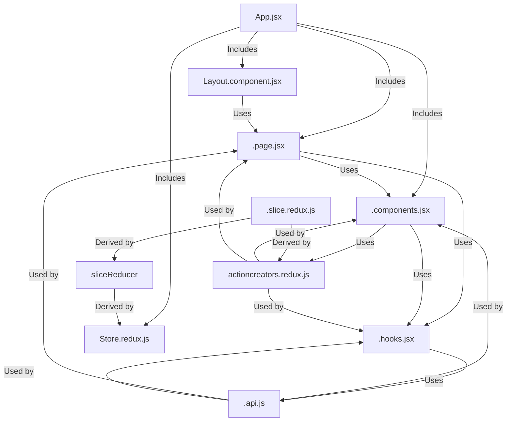

# JobRambo-ui

> Better code reusability, custom hooks, better code splitting, better naming practice
> 

> Better render optimization for state and effects, and component clean-ups
> 

> Better security optimizations
> 



```
jobrambo-ui/
├── public/
├── src/
│   ├── api/
│   │   ├── auth.api.js
│   │   ├── company.api.js
│   │   ├── config.api.js
│   │   ├── index.js
│   │   ├── job.api.js
│   │   ├── jobapplication.api.js
│   │   ├── routes.api.js
│   │   └── user.api.js
│   ├── assets/
│   │   ├── fonts/
│   │   │   ├── Montserrat/
│   │   │   │   ├── Montserrat-Italic-VariableFont_wght.ttf
│   │   │   │   ├── Montserrat-VariableFont_wght.ttf
│   │   │   │   ├── OFL.txt
│   │   │   │   └── README.txt
│   │   └── Montserrat.css
│   ├── Components/
│   │   ├── Company/
│   │   ├── Home/
│   │   ├── Job/
│   │   ├── Profile/
│   │   └── ui/
│   ├── configs/
│   │   ├── index.js
│   │   └── route.config.js
│   ├── Hooks/
│   │   ├── index.js
│   │   ├── useDidUpdateEffect.hook.jsx
│   │   ├── usePublicAndStudentsOnly.hook.jsx
│   │   ├── usePublicOnly.hook.jsx
│   │   ├── useRecruiterOnly.hook.jsx
│   │   ├── useSetInitialAppState.hook.jsx
│   │   ├── useToastDismiss.hook.jsx
│   │   └── useUsersOnly.hook.jsx
│   ├── lib/
│   │   └── utils.js
│   ├── Pages/
│   │   ├── Browse.page.jsx
│   │   ├── Companies.page.jsx
│   │   ├── CompanyRegister.page.jsx
│   │   ├── CompanyUpdate.page.jsx
│   │   ├── Error.page.jsx
│   │   ├── ForgotPassword.page.jsx
│   │   ├── Home.page.jsx
│   │   ├── Job.page.jsx
│   │   ├── JobApplications.page.jsx
│   │   ├── JobCreate.page.jsx
│   │   ├── Jobs.page.jsx
│   │   ├── JobsListing.page.jsx
│   │   ├── JobUpdate.page.jsx
│   │   ├── Login.page.jsx
│   │   ├── NotFound.page.jsx
│   │   ├── Profile.page.jsx
│   │   └── SignUp.page.jsx
│   ├── redux/
│   │   ├── actioncreators.redux.js
│   │   ├── index.js
│   │   ├── store.redux.js
│   │   └── slices/
│   │       ├── companies.slice.js
│   │       ├── index.js
│   │       ├── jobs.slice.js
│   │       ├── profile.slice.js
│   │       ├── qurey.slice.js
│   │       └── user.slice.redux.js
│   └── toast/
├── .gitignore
├── components.json
├── eslint.config.js
├── index.html
├── jsconfig.app.json
├── jsconfig.json
├── jsconfig.node.json
├── package-lock.json
├── package.json
├── postcss.config.js
├── README.md
├── tailwind.config.js
└── vite.config.js

```